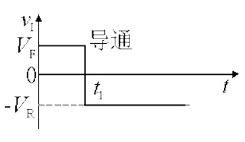
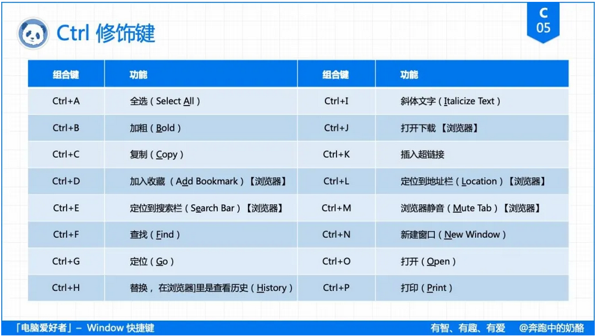
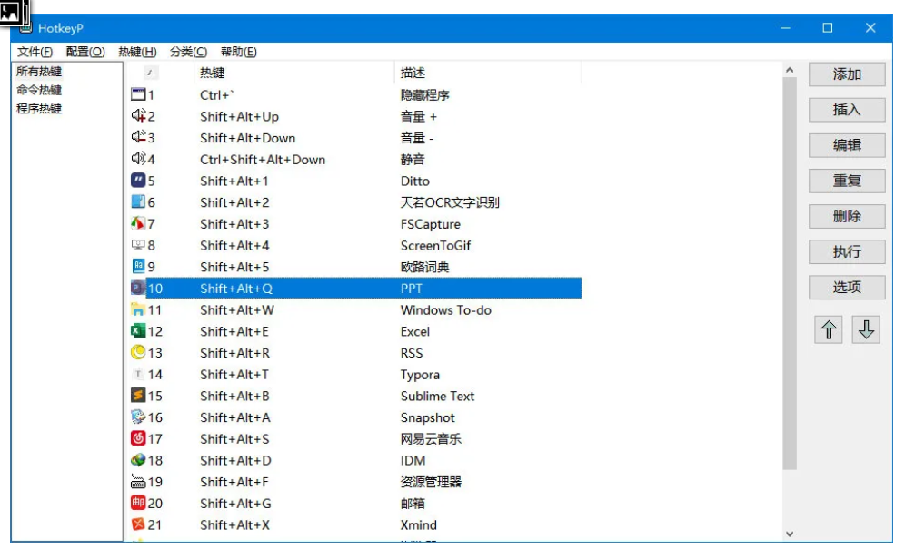

# 1.二极管

## ***（1）二极管反向恢复***

​		二极管作为开关应用的二极管主要是利用了它的通(电阻很小)、断(电阻很大) 特性, 即二极管对正向及反向电流表现出的开关作用。二极管和一般开关的不同在于,“开”与“关”由所加电压的极性决定,  而且“开”态有微小的压降Vf,“关”态有微小的电流I0。当电压由正向变为反向时, 电流并不立刻成为(-I0) , 而是在一段时间ts 内,  反向电流始终很大, 二极管并不关断。

​		经过ts后, 反向电流才逐渐变小, 再经过tf 时间, 二极管的电流才成为(-I0) , 如图1 示。ts 称为储存时间,tf 称为下降时间。tr=ts+tf 称为反向恢复时间, 以上过程称为反向恢复过程。

​		这实际上是由电荷存储效应引起的,  反向恢复时间就是存储电荷耗尽所需要的时间。该过程使二极管不能在快速连续脉冲下当做开关使用。如果反向脉冲的持续时间比tr 短,  则二极管在正、反向都可导通, 起不到开关作用。因此了解二极管反向恢复时间对正确选取管子和合理设计电路至关重要。

​		开关从导通状态向截止状态转变时，二极管或整流器在二极管阻断反向电流之前需要首先释放存储的电荷，这个放电时间被称为反向恢复时间,在此期间电流反向流过二极管。即从正向导通电流为0时到进入完全截止状态的时间。

​		反向恢复过程，实际上是由电荷存储效应引起的，反向恢复时间就是正向导通时PN结存储的电荷耗尽所需要的时间。假设为Trr，若有一周期为T1的连续PWM波通过二极管，当Trr>T1时，二极管反方向时就不能阻断此PWM波，起不到开关作用。二极管的反向恢复时间由Datasheet提供。反向恢复时间快使二极管在导通和截止之间迅速转换，可获得较高的开关速度，提高了器件的使用频率并改善了波形。

​		（就是说，二极管有一定的反向电压，则会有一定时间的反向电流才会反向截止，所以就会有超快恢复的二极管，防止反向电流时间过长导致发热严重）

### *（3-1）1N4007*

​		1N4007的耐压值为1000V，额定正向电流为1A。该管为美国公司生产的二极管，型号中的“1”，指该管为只有一个PN结的器件（即二极管），“N”表示该管已在美国电子工业协会注册登记，“4007”为登记序号。该管为普通的硅整流二极管，<u>这种管子的PN结面积较大，故耐压高，工作电流大，但是其PN结的结电容也大，而这个结电容跟二极管是并联关系，故这种二极管只适用于数百Hz以下的低频整流电路中。若用于上百KHz以上的高频整流电路中，因其结电容较大，管子将失去单向导电作用。</u>	

### *（3-2）UF4007*

​		UF4007虽然外形封装与1N4007完全一样，但是UF4007为快恢复二极管。其耐压值也为1000V，额定正向电流也是1A，但这种管子的反向恢复时间（即从外加反向电压到进入反向阻断状态这一段的过度过程时间）很小，譬如：UF4007的反向恢复时间仅70ns（纳秒），而像1N4007这类低频管，反向恢复时间都较大，手册中通常都不给出这个参数。

​		另外，UF4007这类快恢复二极管的正向导通压降比较大，一般都在0.8～1V以上，而1N4007这类管子的正向压降一般在0.7～0.8V（随流过管子的正向电流不同而异）。

​		UF4007这类快恢复二极管在各种开关电源或电动车充电器中，广泛用于高频整流、续流，而1N4007一般用于工频整流（工频的意思是交流电频率50~60HZ）。使用时，UF4007可以代替1N4007普通整流二极管作为低频整流，但不能用1N4007来代替UF4007作高频整流，因为1N4007在高频电流下，将失去单向导电性。

### 	

## *（2）反向恢复过程详解*

​		硅二极管电路中加入一个如下图所示的输入电压。在0―t1时间内，输入为+$V_F$，二极管导通，电路中有电流流通。




​		设$V_D$为二极管正向压降（硅管为0.7V左右），当$V_F$远大于$V_D$时，VD可略去不计，则

​							      $I_F$ =  $$V_F-V_D/R_L$$

​							当$V_F$ >> $V_D$时：$I_F$ = $V_F$/$R_L$ 

​		在$$t1$$时，$$V$$突然从+$$VF$$变为-$$VR$$。在理想情况下，二极管将立刻转为截止，电路中应只有很小的反向电流。但实际情况是，二极管并不立刻截止，而是先由正向的$$IF$$变到一个很大的反向电流$$IR$$=$$VR$$／$$RL$$，这个电流维持一段时间$$tS$$后才开始逐渐下降，再经过$$tt$$后，下降到一个很小的数值0.1$$IR$$，这时二极管才进人反向截止状态，如下图所示。


​		通常把二极管从正向导通转为反向截止所经过的转换过程称为反向恢复过程。其中$$tS$$称为存储时间，$$tt$$称为渡越时间，$$tre$$=$$ts$$+$$tt$$称为反向恢复时间。由于反向恢复时间的存在，使二极管的开关速度受到限制。

## ***(3)产生反向恢复过程的原因*—电荷存储效应**

​		产生上述现象的原因是由于二极管外加正向电压VF时，载流子不断扩散而存储的结果。当外加正向电压时Ｐ区空穴向Ｎ区扩散，Ｎ区电子向Ｐ区扩散，这样，不仅使势垒区（耗尽区）变窄，而且使载流子有相当数量的存储，在Ｐ区内存储了电子，而在Ｎ区内存储了空穴，它们都是非平衡少数载流于，如下图所示。


​		空穴由Ｐ区扩散到Ｎ区后，并不是立即与Ｎ区中的电子复合而消失，而是在一定的路程LP（扩散长度）内，一方面继续扩散，一方面与电子复合消失，这样就会在LP范围内存储一定数量的空穴，并建立起一定空穴浓度分布，靠近结边缘的浓度最大，离结越远，浓度越小。正向电流越大，存储的空穴数目越多，浓度分布的梯度也越大。电子扩散到Ｐ区的情况也类似，下图为二极管中存储电荷的分布。


​		我们把正向导通时，非平衡少数载流子积累的现象叫做电荷存储效应。

​		当输入电压突然由+$$VF$$变为-$$VR$$时Ｐ区存储的电子和Ｎ区存储的空穴不会马上消失，但它们将通过下列两个途径逐渐减少：①在反向电场作用下，Ｐ区电子被拉回Ｎ区，Ｎ区空穴被拉回Ｐ区，形成反向漂移电流$$IR$$，如下图所示。②与多数载流子复合。


​		在这些存储电荷消失之前，ＰＮ结仍处于正向偏置，即势垒区仍然很窄，ＰＮ结的电阻仍很小，与$$RL$$相比可以忽略，所以此时反向电流$$IR$$=（$$VR$$＋$$VD$$）/$$RL$$。$$VD$$表示ＰＮ结两端的正向压降，一般$$VR$$>>$$VD$$，即$$IR$$＝$$VR$$／$$RL$$。

​		在这段期间，$$IR$$基本上保持不变，主要由$$VR$$和$$RL$$所决定。经过时间ts后Ｐ区和Ｎ区所存储的电荷已显著减小，势垒区逐渐变宽，反向电流IR逐渐减小到正常反向饱和电流的数值，经过时间tt，二极管转为截止。

​		==二极管和一般开关的不同在于,“开”与“关”由所加电压的极性决定, 而且“开”态有微小的压降$$Vf$$,“关”态有微小的电流$$i0$$。当电压由正向变为反向时, 电流并不立刻成为(- $$i0$$) , 而是在一段时间ts 内,反向电流始终很大, 二极管并不关断。==

​		经过ts后,反向电流才逐渐变小, 再经过tf 时间,二极管的电流才成为(- i0),ts称为储存时间,tf 称为下降时间。tr=ts+tf称为反向恢复时间, 以上过程称为反向恢复过程。

​		这实际上是由电荷存储效应引起的, 反向恢复时间就是存储电荷耗尽所需要的时间。该过程使二极管不能在快速连续脉冲下当做开关使用。如果反向脉冲的持续时间比tr 短, 则二极管在正、反向都可导通, 起不到开关作用。


# 2.电磁炉配置


# 3.工作记录

（1）CM15FGY单核灯板程序，R0，R1，R2，R3寄存器就是显示的数码管寄存器，点亮单核的数码管就把值放到这里面，然后再复制13AGY的dsp_debug和显示数字表格即可，调试步骤是，首先把一个常量显示出来，确认能正常显示之后再显示所要显示的变量

（2）DRV8的单核灯板程序，里面存在一个BUG，就是长按按键的时候，会自动清除键值，原因是中断使用了TEMP1，而TEMP1的值就会一直改变，这样导致了下面的程序出现多按键按下的的处理，导致这里程序会清除多按键按下

```assembly
key_prog:    
		SNZ     _TKS_ACTIVEF		;软件包完成初始化标志
        RET
		

		SNZ    	_ANY_KEY_PRESSF
		ret
	
	    SNZ     _SCAN_CYCLEF
	    RET

;;------------------------------ 判断多个KEY按下，刷新
		CLR		KEY_BUF0
		CLR		KEY_BUF1
		CALL    _GET_KEY_BITMAP
		MOV     A,_DATA_BUF[0]
		MOV	 	TEMP9,A （修改）（之前的TEMP1，要改为TEMP9，因为TEMP1在中断会调用，会导致TEMP1的值会一直改变）
		MOV     A,_DATA_BUF[1]
		MOV	 	TEMP8,A（修改）（之前的TEMP2，要改为TEMP8，因为TEMP2在中断会调用，会导致TEMP2的值会一直改变）
		MOV	 	A,16 ;17 ;16
		MOV	 	LOOPJS,A
		CLR	 	MULTIKEYJS
		CLR	 	C         
CHECK_MULTI_KEY:      
        SZ      C	;TEMP2.7	;ACC.7
        INC     MULTIKEYJS
        RLC     TEMP9		;ACC（修改）
        RLC     TEMP8		;ACC（修改）
        SDZ     LOOPJS			;_DATA_BUF[1]
        JMP     CHECK_MULTI_KEY
        MOV     A,MULTIKEYJS
        SUB     A,3	;3	;2
        SNZ     C
        JMP     L_NORMAL_WORK
        SET     _FORCE_CALIBRATEF     ;;刷新死机
        CLR		KEY_BUF0
		CLR		KEY_BUF1  
;		MOV		A,9  
;		MOV		MULTIKEYJS2,A
        JMP	   DSP_DIGIT
```

（3）430反压比304高，所以功率430不好上

（4）（调浪涌）浪涌表格：


```
tab_surge:	dc		00001000b	;0.64vdd(3.2V)(0)
		  	dc		00010000b	;0.68vdd(3.4V)(1)
		  	dc  	00011000b	;0.72vdd(3.6V)(2)
			dc  	00100000b 	;0.76vdd(3.8V)(3)（220V读的表格是3，所以这个）
			dc  	00101000b	;0.80vdd(4V)(4)                   
			dc  	00110000b	;0.80vdd(4V)(5)
```

（5）好厨意雷击炸鸡，改程序，HCY-HW-2035-13AGY(HCY-17 HCY-1809 HW-35灯板通用)(校验码：50A0H)

# 4.物联网操作系统

## (1)*怎样选操作系统*

（1-1）第一：稳定性

（1-2）第二：市场占有率（占有率高代表稳定）

（1-3）第三：LICENSE（授权问题）

（1-4）第四：开发成本

（1-5）第五：外部组件

（1-6）第六：实时性

（1-7）第七：效率（一般跑操作系统要8K RAM以上）

## （2）*物联网操作系统入门开发步骤*

（2-1）系统引入

（2-2）多任务基础

（2-3）多任务调度原理

（2-4）消息队列

（2-5）软件定时器

# 5.飞鸽设置

（5）要增加这两个网段才能添加完所有好友

# 6.键盘使用

## （6-1）*编辑键和导航键*


## （6-2）*锁定键和综合键*


## （6-3）*F1~F12 键的通用功能*

​		F1 就是 **Function 1**（功能1）的意思，依此类推，它的作用是将常用功能固定在键盘上，方便随时使用，可以说是**快捷键的快捷键**。

​		而 F1~F12 键的功能早在 DOS 年代就固定了下来，比如按 **F1 键无一例外都是打开帮助手册**，F2、F3、F4 的功能分别是编辑、跳转、退出。


## （6-4）*Alt - 转换键*

​		Alt 的全称是 **Alternative**，意思是交换、替换，早在 DOS 系统时期， Alt 键的作用是用于切换菜单。

​		后来在 DOS 系统的基础上，微软推出了图形化的 Windows 系统，“窗口”正式出现，于是 **Alt 键的作用就变成了对窗口的操作**。

（6-4-1）**Alt 键之于菜单、对话框**

​		单独按下 Alt 键时，焦点会转移到应用程序的菜单栏上，而如果与**菜单栏、对话框**括号里的（字母）同时按下，则会直接激活该选项。

​		比如按**Alt+F**会直接激活菜单“**文件(F)**”，在对话框里按 **Alt+S** 就等于点击了“**保存**”。（按空格也可以）


​		所以如果你想新建一个窗口，除了使用快捷键 **Ctrl+N**，先按一下 **Alt+F** 激活菜单，然后再按一下 **W** 也可以。

（6-4-2）**Alt 键之于窗口**

​		Alt 键的另一个作用是与窗口操作相关，比如 **Alt+Tab** 是打开任务切换窗口，**Alt+空格** 是打开窗口控制选单。

​		又比如单独按 **PrintSceen** 键是全屏截图，而与 **Alt** 键同时按下，则会只对当前窗口进行截图。


## （6-5）*Ctrl - 控制键*

​		Ctrl 的全称是 **Control**，意思是控制，Ctrl 键可以说是**快捷键的核心**，绝大多数应用程序的快捷键都是通过 Ctrl 键来执行的。

​		Ctrl 键的快捷键有很多，而且不同的应用程序也会有所不同，但如果知道了快捷键里**字母键的英文原义**，比如 Ctrl+A 里的 A 是 All 的缩写，Ctrl+S 是 Save 的缩写，那么记起来就容易多了。



​		也有一些快捷键不那么好理解。

​		比如为什么添加书签的快捷键是 **Ctrl+D**，而不是 **Ctrl+B**（Bookmark）？原因 Ctrl+B 被加粗字体（**Bold**）给占用了。

​		那为什么又不是 **Ctrl+A**（Add Bookmark）呢？因为被全选（**All**）给占用了，所以只好选择了 **Add** 里的字母 **D**。


​		还有一些快捷键则与英文原义无关。

​		比如 Ctrl+C 里的 C 是 Copy，但为了方便，粘贴并没有使用 Paste 的 P 键，而是用了 V 键，因为这样的确更加顺手，P 键实在太远了。

​		剪贴键 **Ctrl+X** 也一样，放在了 C 键旁边也是为了方便，而且 X 键就像是一把剪刀，理解为剪贴也很合理，**Ctrl+Z** “撤销” 则像是我们写错了东西，然后用橡皮擦擦掉。


## （6-6）*Windows - 徽标键*


## （6-7）*Shift - 换档键*

​		最后是 Shift 键，Shift 的意思是切换，来源打字机，用于切换字母大小写，所以也叫做**换档键**。

​		而当 Shift 键与其他修饰键一起组合使用时，同样也是起到“**换档**”的作用。比如 **Ctrl+S** 是保存，**Ctrl+Shift+S** 就变成了另存为，**Ctrl+N** 是新建窗口，**Ctrl+Shift+N** 就变成了新建文件夹，又比如浏览器里 **Ctrl+D** 是收藏书签，**Ctrl+Shift+D** 则变成了收藏所有书签。

​		Shift 的切换，还可以是正反、有无、左右等**相对意义上**的切换。比如 **Ctrl+T** 是新建标签页，**Ctrl+Shift+T** 则是恢复标签页，**Ctrl+Tab** 是切换标签页， **Ctrl+Shift+Tab** 则是反向切换标签页，**Ctrl+Z** 是撤销，**Ctrl+Shift+Z** 则是恢复撤销。


​		Shift 的作用还有很多，比如：

1、按住 Shift 键选择，可以**连续选择**两个对象之间的内容。

2、按住 Shift 键点击链接，会使得链接在**新窗口**中打开。

3、按住 Shift 键右键点击文件，菜单里就会新增一个「**复制为路径**」的选项。
4、在 Ctrl+V 粘贴时，加上 Shift 键就可以实现**无格式粘贴**。

5、按 Shift+F10 还可以呼出**右键菜单**。

6、如果需要用到 F13 键，那么 Shift+F1 就是 F13，依此类推。

## （6-8）*如何记住快捷键*

​		看了上面这么多的快捷键，想要记住它们可不容易，所以我总结了一条快捷键的使用逻辑：

​		**4 大修饰键 Alt、Ctrl、Shift、Win 的功能是分工且合作的。**

​		分工方面，每个修饰键都可以与字母键单独组合。

​		**Alt 键负责与菜单、对话框、窗口相关的操作，Ctrl 键负责应用程序内的功能，Win 键负责系统本身的功能，Shift 键则用于功能切换。**

​		合作方面，如果修饰键要组合一起使用，那顺序是这样的：

​		1、Ctrl 键是**快捷键的核心**，绝大多数应用程序的快捷键都是通过 Ctrl 键来执行 ，比如 **Ctrl+S** 是“保存”。

​		2、如果这个操作有**另一种选择**，那么就加入 Shift 键来换档，比如 **Ctrl+Shift+S** 就变成了“另存为”。

​		3、如果有**第三种选择**，那么就会再加入 Alt 键，比如在 PS 里，**Ctrl+Shift+Alt+S** 就是“另存为 Web 项目格式”。

​		4、那如果还有**第四种选择**呢？第四种选择就**不会再叠加修饰键**了，而是会重新换一个字母键。

​		5、如果有些功能需要全局调用，那么就用 **Ctrl+Alt+...** 的组合键。

Alt 键代表窗口，与 Alt+Tab 是切换任务窗口的理由一样，**Ctrl+Alt+...** 的组合快捷键就是为**跨应用程序**而设置的，而且这样的组合也不容易造成快捷键的冲突。

​		比如 QQ 的全局截图快捷键就是 **Ctrl+Alt+A**，微信的界面显示/隐藏快捷键是 **Ctrl+Alt+W**，还有网易云音乐的切歌快捷键也是 **Ctrl+Alt+方向键**。

​		6、至于 **Shift+Alt+..** 这样的组合键，极少有应用程序会这样设置，所以是空着的。

​		7、最后，Win 键也极少会与其他修饰键一起使用，比如 **Win+Shift+S**（系统截图 Snapshot）也仅仅是因为 **Win+S** 已经被（ 搜索 Search ） 占用了。

​		也就是说，Windows 快捷键的组合顺序是这样的：


​		还有一个值得一说的细节。

​		Windows 下的快捷键标记方式通常都是：**1Ctrl+ 2Shift+ 3Alt+**。

​		但也不全是这样，比如 Adobe 系统软件里的 PS 和 AI，采用的就是 Mac 式的标记方式，也就是：**3Alt + 2Shift +1Ctrl +**。


## （6-9）*自定义快捷键*

​		正因为快捷键历史问题导致的“**路径依赖**”，所以 Windows 快捷键也有很多不合理的地方，我们可以进行必要的修改。

#### **1、修正历史使用习惯**

​		比如 **F1** 键原来是打开帮助手册，但现在已经很少有人会用这个功能了，将 **F1** 修改为“**新建标签页**”是个不错的选择，特别是在浏览器等**多标签页**软件上非常实用。

​		又比如 **Alt+F4** 是关闭应用程序这种奇葩设定，难道不是 **Ctrl+Q**（Quit）更加合理吗？而现在它居然是空着的，和 **Ctrl+W** 放一起，一个关闭标签页，一个关闭应用程序，难道它不香吗？


​		不用担心误触的问题，设置敲空格二次确认就好了。（回复关键字 **C05** 可获取奶酪的配置）

#### **2、利用空闲的快捷键**

​		我们还可以利用空着的 **Shift+Alt+...** 快捷键来设置一套符合我们工作流程的快捷键，此前我们在《[Window 高效操作](http://mp.weixin.qq.com/s?__biz=MzAwMjUyNzYxMw==&mid=2247487111&idx=1&sn=c1bc4ee6729903a579236c391f11903c&chksm=9ac85695adbfdf83f645f89a0601807d453cbe060f89ae23d1c46452c8ff5eeb275cbc63b2cd&scene=21#wechat_redirect)》中谈到了用软件 **HotkeyP** 来设置，如下图：


​		此外，我还将经常要用到的方向键也加入了进来。

​		因为在编辑文字时，我们需要经常伸手去拿鼠标来改变光标的位置，又或者需要挪动右手去按远在“**天边**”的方向键。

​		如果将这些操作定位在 **J** 键周围，那就大大降低了右手需要移动的距离，我们就更能专心于当下的工作，进入“**心流**”工作状态。

​		举一个大家都会遇到的场景。

​		我们在边看视频看边做笔记时，将浏览器分屏在左边，笔记在右边，需要暂停视频时，按一下**空格**。

​		这时再按一下快捷键 **Shift+Alt+T**，那么就会将焦点切换到 Typora 笔记上来。

​		接着，我们记录下视频刚刚里的内容，完毕后再按快捷键 **Shift+Alt+B**，再将焦点切换回浏览器上。

​		再按下空格，视频继续播放，如此往复，期间可以完全不用鼠标。

**何其美哉！**

​		当你做到这些时，不但自己很“**爽**”，因为没有非必要场景切换，我们就更容易进入高效的“**心流**”工作状态。  

## 7.WINDOWS高效操作

### （7-1）文件管理

（7-1-1）多标签浏览（**QTTabBar** ）

​		如果你需要打开多个资源管理器，**QTTabBar** 是一个很好的浏览增强工具。

​		它最大的功能是「**多标签页浏览**」，可以方便我们管理文件，「**群组功能**」还可以一键打开常用文件夹，将文件夹「**锁定**」后，还能防止被关闭，省去经常要找它们的烦恼。


（7-1-2）文件预览（**QTTabBar** ）（**QuickLook**）

​		它可以让 Windows 拥有像 Mac 一样按空格键预览文件的功能，文件格式支持完善，大多数常见文件格式都能一键预览，比如 **PDF、Markdown、Mp3、Mp4、ZIP、PSD** 等。

​		特别是它还有“**连续预览**”功能，将预览窗口移到一边，用鼠标点选文件，预览窗口就会实时显示文件内容。

（7-1-3）文件定位（**Listary**）

​		还有一种情况，当需要**打开或保存文件**时，我们需要在弹出来的对话框里去切换想要的路径，**Listary** 可以这一过程变得简单。

​		它会在**对话框的下方**侧新增一个工具栏，其中有两个功能可以用来定位文件：

​		一是记录**打开过的文件和文件夹**，方便一键切换。

​		二是按快捷键 **Ctrl+G** 时，对话框会定位到**最后打开的文件夹**上，这个功能可以说相当的实用。

### （7-2）软件启动

​		我们再来看看软件的启动方式。

​		很多人都喜欢把软件的图标放在桌面上，但这不是一个好选择，它更多的是**历史原因导致的**。

​		有一个笑话，说的是 Windows  的“**开始菜单**”虽然叫“**开始**”，但大多数人都是奔着“**关机**”去的。

​		早先版本的 Windows “**开始菜单**”是一个列表选项，想要打开某个软件，用户需要后在众多的选项中查找选择，很不方便，于是人们**干脆就直接放在桌面上**。


（7-2-1）**Windows 的磁贴功能是软件启动的绝佳选择**

​		在任何时候按下 **Win** 键就会呼出界面，点击任意地方又会自动隐藏，很是方便。


​		**开机后肯定会用到的软件**（通常会是系统增强软件），我们可以设置让它随机启动。

​		**经常会用到的软件**（比如浏览器、微信、笔记本），可以将它们固定在“**任务栏**”上，方便随时启用。

​		而其他的软件，则都放到磁贴上。

### （7-3）任务切换

​		（**HotkeyP**）

​		任务窗口切换也是常用操作，如果你沉浸于工作，肯定不希望因为切换的问题而打断了思路。

​		比如你在写文章，突然想边听音乐边写，中途还可能要打开浏览器查询资料，最后还要在文章中插入图片素材，这时肯定少不了一顿操作。

​		**HotkeyP** 正是解决这样问题的一款软件，它可以通过设置**快捷键**来启动或者切换任务窗口。



​		它最大的特点是**如果应用程序已经打开**，那么按下快捷键时就会**切换到这个任务窗口中来**，而不是再打开一个窗口。

​		我们可以使用 **HotkeyP** 来设置一套合乎自己工作流程的快捷键，没有了非必要场景转化，效率也就大为提高。

下面是我的一些使用经验：

​	1、根据个人情况添加快捷键，设置自己**最常用的那几个软件**就可以了。

​	2、最好使用“**Alt+Shift+字母键**” 的组合，这样快捷键冲突的可能性最小。

​	3、快捷键最好使用与软件相近的英文或拼音，比如 **Typroa (T)、Excel (E)、RSS (R)、微信 (V)**。

当然了，不可能完全一致，只要是你觉得**说得过去的排布逻辑**就行。比如我的设置思路是：

**第一行**：工具软件

**第二行**：工作软件

**第三行**：常用软件

**第四行**：常用软件


​		除了系统自带的 **Win + D** 显示/隐藏桌面，我还设置了 **Ctrl + ~** 为显示/隐藏当前窗口，它可以给所有的软件设置一个通用的“**老板键**”。

### （7-4）窗口管理

​		在一些需要频繁切换任务窗口的场景，除了上面的方法，有没有更高效的解决方案呢？

（7-4-1）窗口分屏（WIN自带）

​		比如边查资料边收集，又或者边看视频边做笔记的时候，需要频繁地在两个或者多个窗口之间切换，使用 Windows 的「**分屏功能**」，就可以省去来回切换的烦恼。


​		分屏功能的操作很简单，只需要将窗口拖动到屏幕的边缘，窗口就会自动吸附，使用「**Win+方向键**」也可以实现相同的效果。

（7-4-2）窗口置顶（DeskPin）

​		如果你不喜欢窗口分屏，因为分屏可能会破坏原来的界面排布，使用“**窗口置顶**”工具也可以实现类似的分屏效果，就像浏览器里的“**视频小窗播放**”。

​		窗口置顶工具推荐用 **DeskPin**，或者也可以使用鼠标手势划“**M**”来置顶（下面会有说明）。


（7-4-3）虚拟桌面（WIN自带）

​		Windows 10 还提供了“**虚拟桌面**”的功能，可以给用户提供多个桌面。

​		多桌面的运用，就像是从普通的“**方形办公桌**”变成了“**L形办公桌**”。

我们可以一边放工作内容，一边放其他的内容，起到**工作归工作，其他归其他**的效果。


​		比如在“**桌面 1**”放置工作中才会用到的应用程序，例如**资源管理器、浏览器、PPT、Typora** 等，而“**桌面 2**”则放置工作以外的应用程序。


这样做还有一个好处。

​		就是当你使用 **Alt + Tab** 来切换任务时，任务列表会只显示“**桌面1**”中的应用程序，我们可以只在“**强相关**”的窗口任务中选择切换。

下面是虚拟桌面常用快捷键：

**Win+Tab**：打开「任务视图」

**Win+Ctrl+D**：创建新的虚拟桌面

**Win+Ctr+左键**：切换到上一个桌面

**Win+Ctrl+右键**：切换到下一个桌面

也可以用鼠标手势来切换，下面会有说明。

（7-4-4）鼠标手势（**Mouseinc**）

​		鼠标手势的功能来源于浏览器，它可以**不用考虑鼠标的移动精确度**，只需要按住**右键**，在屏幕上划出轨迹就可以执行**前进/后退、最大/最小化、关闭/新建标签页**等操作。

​		软件 **Mouseinc** 提供了丰富的手势功能，它可以给所有的应用程序**共用一套鼠标手势**，对于**个别特殊的应用程序**，比如浏览器，软件也可以设置单独的鼠标手势。

​		我的鼠标手势方案主要有两套，第一套是**方向轨迹**。（回复关键字 **C09** 获取奶酪配置）


​		黑色字体为**通用手势**，灰色字体为**浏览器专用手势**，浏览器包括 Chrome、Firefox、Edge，还有其他国产浏览器也共用一套标准。


​		第二套是**字母轨迹。**


​		值得一提的手势是「**M**」，它可以让当前窗口置顶，再次「**M**」则会取消置顶，可以省去了一个窗口置顶软件。

​		还有它的「**贴图**」功能和「**文字识别**」功能也十分亮眼。


（7-4-5）**复制增强**（**Mouseinc**）

​		当你想要搜索的时候，只需要选取文字，使用鼠标手势划出「**S**」就可以调用浏览器搜索。

​		同时 **Mouseinc** 还有一个特别的功能：**复制增强**。


​		选中文字后，快速按下两次 **Ctrl+ C**，这时会弹出一个菜单，里面可以设置**网页搜索、图片搜索、翻译**等功能。

​		将“**网页搜索**”的快捷键设置为 **C**，那么再次按下 **C** 键时就能进行一键搜索了。


## 8.密码管理


### 9.常用软件推荐


